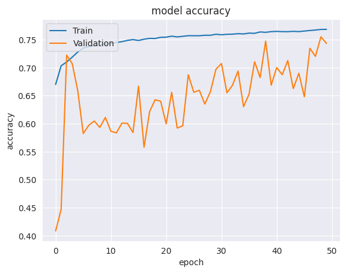

# Histopathological Cancer Detection Using Deep Learning


## Contents
- [Introduction](#introduction)
- [Overview](#overview)
- [Data](#data)
- [Method](#method)
- [Experimentation](#experimentation)
- [Results](#results)
- [References](#references)

## Introduction
> AI plays a crucial role in perception tasks, such as 
image classification. A straightforward neural network can 
accurately classify images into different categories, even if 
the images contain hidden, occluded, or unusual features. 
This is because the network is able to learn from the data, 
rather than relying on manually defined filters for feature 
detection. In contrast, traditional computer vision 
algorithms require these filters to be defined for each class 
of interest, which is difficult or impossible to do for all 
possible features and variations. As a result, neural 
networks can outperform traditional algorithms in many 
cases. <br> <br>
> Cancer Detection is one of the areas of healthcare where 
Deep Learning can play a huge role. It is the leading cause 
of deaths in the world and one in six deaths can be 
attributed to cancer [[1]](https://www.who.int/news-room/fact-sheets/detail/cancer#:~:text=Cancer%20is%20a%20la "Cancer Deaths factsheet, WHO"). One 
defining feature of cancer is the rapid creation of abnormal 
cells that grow beyond their usual boundaries, which can 
then invade adjoining parts of the body and spread to other 
organs known as metastases are the primary cause of death 
from cancer. Our focus will be on Breast Cancer which is 
one of the most common forms of cancer. For a long time 
now, oncologists depend on the assessment of scans made 
by pathologists. We propose to make use of AI to help aid 
the process. The increasing adoption of deep learning 
across healthcare domains together with the availability of 
highly characterized cancer datasets has accelerated 
research into the utility of deep learning in the analysis of 
the complex biology of cancer. <br> <br>


## Overview
> Our proposition here is to build a Deep Learning model 
based on Convolutional Neural Networks to help create a 
model which can classify histopathological slide images of 
lymph node sections and determine if a certain image has 
metastatic tissues. This solution is not intended to replace 
the medical practitioner in making cancer diagnosis, but to 
aid and supplement their diagnosis.
The kind of cancer in focus here is Breast Cancer, one 
of the most common forms of cancer. <br> <br>
> The models trained on non-augmented images converge 
to a solution at a much faster rate. 
An approach that was considered but not tested, was to 
train a model to a high degree of accuracy. Then use a 
transfer learning approach as the model already can detect 
cancer in the center of a slide image. The weights could be 
locked, and additional layers could be added to detect 
cancerous cells in the augmented images.
### Input/Output of the Model
> Deep-learning algorithms such as CNNs have been 
designed to perform computer vision tasks. A multitude of filters encoding different pixel intensity 
patterns convolve across the image to produce two-dimensional activation maps of each filter.The algorithm takes in images as input from the data 
and outputs the predicted ID label, 1 or 0, for the images. 
The image ID and the prediction label is used to check the 
accuracy of the model.
### Metrics for Evaluation
> The data is organized such that the CSV files have the 
image ID and the label to go along with it. When an image 
is used in training, the predicted label for that image will 
be compared with the actual label to evaluate its 
efficiency. This metric will also be applied on the testing 
set to evaluate its efficiency as well. Another metric we 
will be using is the Area under ROC curve. It is a plot of 
TP vs FP (True Positive vs False positive rate) at different
threshold values

## Data
> The project uses the Histopathological 
Cancer Detection dataset offered on the Kaggle 
Competion [[2]](https://www.kaggle.com/c/histopathologic-cancer-detection "Kaggle Dataset"). It is a slightly updated version of the PatchCamelyon (PCam) dataset which is a vast collection of small image patches taken from larger digital pathology scans of breast lymph node sections. <br>
> The breakdown is as follows:
> * Training: 153k (0.9) images
> * Validation: 17k (0.1) images
> * Testing: 57.5k images
>
> A positive label on an image indicates that the 
center 32x32 pixel region of a patch contains at least one 
pixel of tumor tissue. This helps in creating models that do 
not use any zero-padding when using Convolutional 
Neural Networks

### Exploratory Data Analysis
> We investigated the dataset to see if the sampled data in 
training and validation and testing are homogeneously 
arranged, i.e., equal distribution of images with label 1 
(cancerous) and label 0 (benign) in all sets of data. <br>
 <br> <br>
> Exploring further we can see about further statistics in 
the data. One thing to note here is the mean of the data is 
about 0.405031. This means that the negative and positive 
samples in the data aren’t split equally.<br>
 <br> <br>
> Representing the same data as an histogram <br>
 <br> <br>
> Now we can selectively sample images from the test set of normal and cancerous images. This gives us more control over what images we want to see. Once again, we can see the center 32x32 portion of the image to see if the image has cancer cells or not.
 <br> <br>

## Method
> We believed the best approach was to use augmented 
slide images. A known accurate CNN model was trained 
for 10 epochs with the non-augmented images. The trained 
model was detecting cancer cells with approximately 87%
accuracy on non-augmented slide images. Testing the
trained model with augmented slide images, the detection 
accuracy drops to approximately 70% accuracy. The 
models trained on non-augmented images converge to a
solution at a much faster rate.

## Experimentation
> To have a model that will detect cancerous cells when 
not centered and from noisier data, we first need to 
generate noisy images. We took advantage of some of the 
built-in Keras functionality in Tensorflow. The load image
function has built in image augmentation capabilities. The
images were augmented randomly with random
augmentations being applies. The images were being 
shifted, rotated, flipped, color and contrast shifted. The
augmented images were used to test trained CNN models
on regular slide images. There was a significant drop in
detection accuracy on the ‘non-clean’ images. <br> <br>
> The CNN network was made to detect 
many early small features in the image. The model had 
256 filters for the first two layers. The model is as follows with 2x2 kernals sizes and filters as follows: 256, 256, 128, 1268, 64, 64, 128, 128.
```
4 x [Conv -> BatchNorm -> Conv -> ReLU -> BatchNorm -> MaxPool -> Dropout] 
```
> As can been interpreted from the graphs, the model was 
still learning and starting to converge. If the model had 
more time to train it would eventually be detecting with a 
higher accuracy. We were working on other model 
concurrently to try and reduce the jitter in the convergence 
of the model and speed up training time. The first layer has 8 16x16 
filters with up to six CNN layers before 4 fully-connected 
layers. That model trains at 3 minutes/epoch which is a 
significant improvement and the jitter during training is 
reduced.
>|Model|Summary Plot|
>|:-:|:-:|
>|Model Area Under the Curve||
>|Model Accuracy||
>|Model Loss||

## Results
After training our model on this data, we used it for
Breast Cancer Detection. The model we finalized 
converged well with a good Area under the Curve even 
with augmented data. The trained model would detect with 
a 87% accuracy rate for both augmented slide images and 
non-augmented slide images. After training the model had
an AUC on the trained data of 0.9567 and an AUC of 
0.9663 on new data. The state-of-the-art [[3]](https://paperswithcode.com/sota/breast-tumour-classification-on-pcam "Breast Tumour Classification on PCam") currently (DSF-CNN) achieves an AUC around 0.975.
The model even after 125 epochs was still working on 
converging. With more training the model shows the 
potential of having a better detection accuracy.
We achieved similar detection accuracy results as the 
model we based our solution off of [[4]](https://www.kaggle.com/code/mattison/cancer-cnn-detection "Mattison Hineline"). It is worth noting 
that our model achieved that accuracy for both augmented 
and non-augment images, whereas the model we 
referenced [4], when tested on augment data, the detection 
accuracy was between 65% and 75%. The range is due to 
the random generation of augmented data, the more the 
augmented data the worse the model performs

## References
[1] World Health Organization: Cancer Factsheet – [Cancer Deaths factsheet, WHO](https://www.who.int/news-room/fact-sheets/detail/cancer#:~:text=Cancer%20is%20a%20la) <br>
[2] Histopathological Cancer Detection Dataset – [Kaggle](https://www.kaggle.com/c/histopathologic-cancer-detection) <br>
[3] Papers with code, “Breast Tumour Classification on PCam”, 
Leaderboard – [Papers with code](https://paperswithcode.com/sota/breast-tumour-classification-on-pca) <br>
[4] Mattison Hineline, “Cancer CNN Detection”, Kaggle, – [CNN Cancer Detection](https://www.kaggle.com/code/mattison/cancer-cnn-detection)

